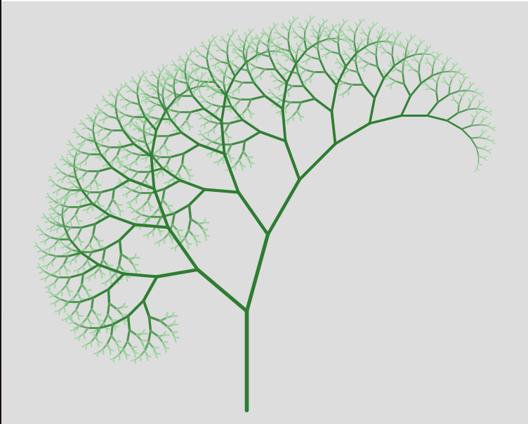
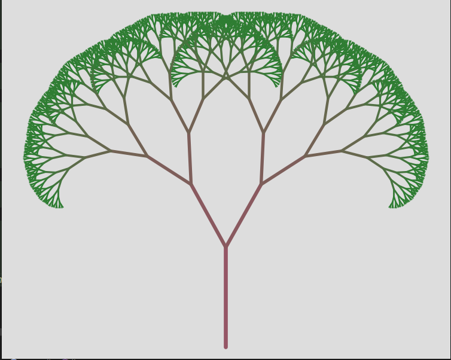
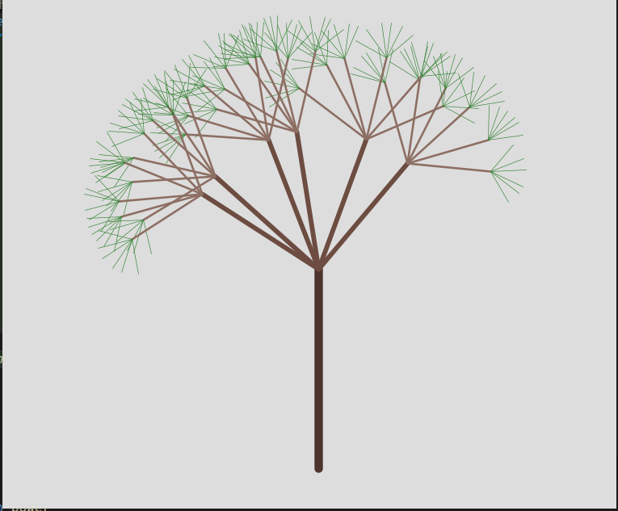

# Trees

A Clojure library for generating 2D tree structures using composable growth algorithms.

- [Trees](#trees)
  - [How It Works](#how-it-works)
  - [Examples](#examples)
    - [Lopsided Spiral](#lopsided-spiral)
    - [Binary Symmetric](#binary-symmetric)
    - [Jittered and Offset](#jittered-and-offset)
  - [Algorithm organization](#algorithm-organization)
  - [Visualizing with Quil](#visualizing-with-quil)
  - [Colour inputs](#colour-inputs)


## How It Works

Trees are represented as nested maps where each branch has `:start`, `:end`, `:length`, `:rel-angle`, `:abs-angle`, and `:children`. The `trees.tree/grow` function builds trees using pluggable algorithm functions that control:

- **Child creation** - when to stop adding branches
  - Works on an 'iterator' style pattern - Rather than decide on the number of children up front, it keeps asking whether another child should be added until the answer is false. Would allow, for example, to keep adding branches of a random angle until some total angle is surpassed.
- **Branch angles** - how branches spread from their parent
  - Branch angles are specified clockwise from the angle of the parent branch. The trunk's parent is assumed to be straight up (90°)
- **Branch lengths** - how long each branch grows
- **Visual properties** - width and colour

Algo functions are passed a zipper to the current node (new node or potential parent) so that they can base their decisions on the tree generated so far if they wish. Branch properties are calculated in the order angle, length, width, and colour.

## Examples

Examples that can be passed to `trees.tree/grow`. See `dev/tree/output.clj` for examples of growing a tree, and drawing with [Quil](https://github.com/quil/quil).

### Lopsided Spiral



```clojure
(require
   '[trees.algo.length :as length]
   '[trees.algo.children :as children]
   '[trees.algo.colour :as colour]
   '[trees.algo.combine :as combine]
   '[trees.algo.curve :as curve]
   '[trees.algo.indexed :as indexed])
  
  (def lopsided-spiral
    {:add-child?
     (combine/with :and
                   (children/count<= 2)
                   (children/length>= 5))
     
     :branch-angle
     (tree/with-vertical-trunk
       (indexed/by-child [-50 65]))
     
     :branch-length
     (combine/with *
                   (length/of-parent 150)
                   (indexed/by-child [0.65 0.8]))
     
     :branch-width
     (curve/scale 4.0 0.90)
     
     :branch-colour
     (colour/gamma
      "#2E7D32" "#A5D6A7"
      indexed/length
      150 5
      32)})
```

### Binary Symmetric



```clojure
(require
   '[trees.algo.angle :as angle]
   '[trees.algo.children :as children]
   '[trees.algo.colour :as colour]
   '[trees.algo.combine :as combine]
   '[trees.algo.curve :as curve]
   '[trees.util :as u])
  
  (def binary-symmetric
    {:branch-angle
     (tree/with-vertical-trunk
       (combine/with *
                     (angle/regularly-spaced 2 2)
                     (curve/scale 32.0 0.92)))
  
     :branch-length
     (curve/scale 100.0 0.72)
  
     :add-child?
     (combine/with :and
                   (children/depth<= 12)
                   (children/length>= 2.0)
                   (children/count<= 2))
  
     :branch-width
     (curve/scale 4.0 0.90)
  
     :branch-colour
     (colour/linear "#955565" "#2E7D32"
                    u/depth
                    1 10)})
```

### Jittered and Offset



```clojure
(def jittered-and-offset
    (let [depth    4
          children 6]
      {:add-child?    (combine/with :and
                                    (children/count<= children)
                                    (children/depth<= depth))
       :branch-angle  (tree/with-vertical-trunk
                        (combine/with +
                                      (angle/regularly-spaced 120 children)
                                      (angle/offset -5)
                                      (jitter/even 10)))
       :branch-length (curve/power 200 1.25 (inc depth))
       :branch-colour (indexed/by-depth
                       [(colour/ensure-rgba "#4E342E")
                        (colour/ensure-rgba "#6D4C41")
                        (colour/ensure-rgba "#8D6E63")
                        (colour/ensure-rgba "#308030")])
       :branch-width  (curve/power 10  2    (inc depth))}))
```

## Algorithm organization

The library splits growth logic into focused modules under `src/trees/algo/`:

- **`angle.clj`** - functions that return branch angles (degrees, clockwise)
  - `regularly-spaced`, `offset`, `scale`
  
- **`length.clj`** - functions that return branch lengths
  - `of-parent`, `scale`
  
- **`children.clj`** - predicates that decide whether to add a child
  - `count<=`, `depth<=`, `length>=`
  
- **`combine.clj`** - compose multiple algorithms together
  - `with` - combine with operators like `*`, `+`, `:and`, `:or`
  
- **`curve.clj`** - decay/growth curves for length and width
  - `scale`, `power`, `linear`
  
- **`colour.clj`** - colour gradients and transitions
  - `linear`, `gamma`, `smoothstep`, `ensure-rgba`
  
- **`indexed.clj`** - per-child or per-depth algorithm selection
  - `by-child`, `by-depth`
  - Accessors: `depth`, `length`, `width` - extract common values from zipper locations
  
- **`jitter.clj`** - randomness utilities
  - `even` - uniform random offset

Each algorithm function accepts a zipper location and returns the appropriate value (angle, length, boolean, etc.). See [`.github/copilot-instructions.md`](.github/copilot-instructions.md) for details on writing custom algorithms.

## Visualizing with Quil

The `dev/` folder contains presets and rendering helpers:

**Presets**: `dev/examples.clj` has ready-to-use configurations:
- `binary-symmetric` - classic symmetric binary tree
- `radial-fan` - evenly spaced multi-child fan
- `lopsided-spiral` - asymmetric spiral growth
- `jittered-and-offset` - randomized placement

**Drawing**: Use `dev/viz/draw.clj` to render with Quil:

```clojure
;; At the REPL:
(require '[quil.core :as q]
         '[dev.viz.draw :as draw]
         '[dev.examples :as examples]
         '[trees.tree :as tree])

(def my-tree (atom (tree/grow (examples/lopsided-spiral))))

(q/defsketch demo
  :title "tree-demo"
  :size [800 600]
  :setup (fn [] (q/frame-rate 30))
  :draw (fn []
          (draw/draw-tree @my-tree 
                         {:width 800 :height 600
                          :scale :contain
                          :padding 20
                          :bg 0xFFFFFFFF})))

;; Regenerate with different params:
(reset! my-tree (tree/grow (examples/lopsided-spiral 
                             {:angles [-70 45]
                              :trunk-length 200})))
```

**Scale options** control how the tree fits into the window:
- `:none` - No scaling (1:1), tree may overflow or appear tiny
- `:to-fit` - Shrink if needed to fit, never enlarge (max scale 1.0)
- `:to-view` - Enlarge if needed to fill window, never shrink (min scale 1.0)
- `:contain` - Scale to fit entirely within viewport

## Colour inputs

Colours can be specified as:
- Hex strings: `"#RGB"`, `"#RRGGBB"`, `"#RRGGBBAA"`
- Integer ARGB: `0xAARRGGBB`
- Vectors: `[r g b]` or `[r g b a]` (0-255 per channel)

Supply either a constant colour or a function of the zipper location:

```clojure
{:branch-colour "#2E7D32"}  ; constant

{:branch-colour (fn [loc]   ; dynamic based on depth
                  (if (< (trees.util/depth loc) 3)
                    "#2E7D32"
                    "#A5D6A7"))}
```

